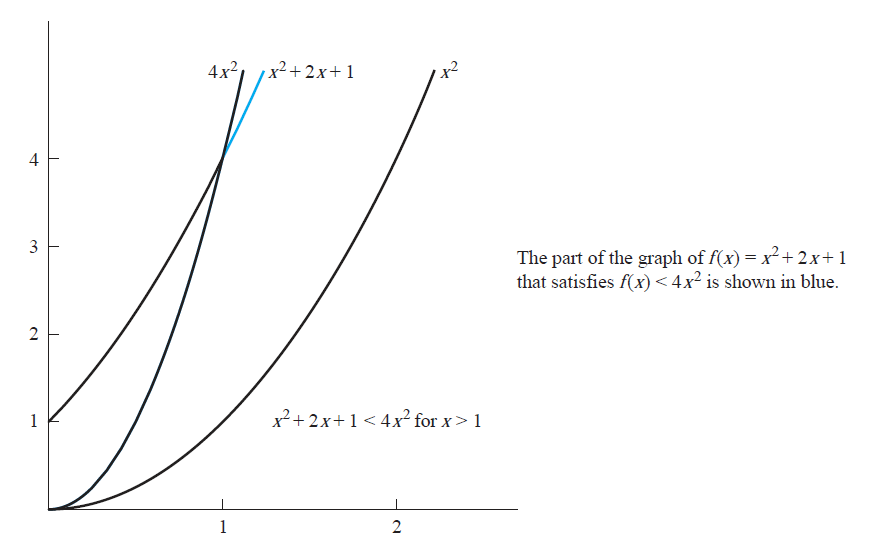

+++
date = '2023-02-06T22:17:50-05:00'
draft = false
title = 'Big-O Notation Explained'
description = 'This post is a ~5 minute tutorial on Big-O notation for computer science students.'
+++

Big-O (along with big-Theta and big-Omega) are concepts in mathematics and computer science that were popularized by the legendary [Donald Knuth](https://en.wikipedia.org/wiki/Donald_Knuth). If you're studying anything to do with computers, you'll likely run into this concept at some point, and it can be hard to wrap your head around at first. 
<!--more-->

TL;DR, \(f(x)=O(g(x))\) with witnesses \\(C, k\\) means that \\(f(x) \le Cg(x) \forall x \ge k\\)

Given a mathematical function, \\(f(x)\\), the big-O of this function gives us an upper bound for how \\(f(x)\\) scales as \\(x\\) gets bigger. In the graph above, when \\(x\\) is less than 1, \\(f(x)\\) is greater than \\(4x^2\\), but when \\(x\\) is greater than 1, \\(f(x)\\) will always be smaller than \\(4x^2\\).

We use O here because the growth rate of a function can also be called the order of the function. You may also have seen this called the degree of the function. To find the order of a function, we essentially just add the exponents of each term, and the highest exponent is that function's degree/order.

\\(f(x) = 4x^2\\) - this function only has one term (\\(4x^2\\) ), and only one exponent, 2, so the order/degree is 2.

\\(g(x)= 4x^2 + 2x^3\\) - this function has two terms (\\(4x^2\\) and \\(2x^3\\) ). Since 3 is a larger exponent than 2, the order/degree is 3.

\\(h(x) = 4x^2 y^3 + 2x^3 y\\) - this is where the addition of the exponents comes in. The first term has exponents 2 and 3, so we add them and find that the degree is 5.

Going back to the image example: There are two important values to note, called witnesses.

The first witness is the x-axis value of 1, and it is usually represented by \\(k\\). It's important because, from looking at the graph, we can see that when \\(x<1\\), \\(f(x)\\) is actually larger than \\(4x^2\\). \\(k = 1\\) says "\\(4x^2\\) will always be larger than \\(f(x)\\) when \\(x > 1\\).

The second witness is the constant 4 (from \\(4x^2\\)). Look at the third function in the image, which is \\(x^2\\). Notice how it is always less than \\(f(x)\\), and this makes sense because both have a degree of 2. If we have \\(x^2\\) and \\(x^2 + 5\\), the second one will obviously always be larger. However, if we have \\(x^2 + 5\\) and \\(2x^2\\), we can see that after a certain value of \\(x\\), the constant multiple takes over and \\(2x^2\\) is larger from there on. See [Desmos example](https://www.desmos.com/calculator/hs6jwlewxg).

Tying everything all together, we have the following:

\\(O(g(x))\\) and \\(C\\) - \\(g(x)\\) is the function which is an upper bound for \\(f(x)\\) when it has a constant multiple of \\(C\\). \\(g(x)\\) on its own might not be an upper bound for \\(f(x)\\), but \\(C \cdot g(x)\\) is.

\\(k\\) - the x-value where \\(g(x)\\) actually is an upper bound. For x-values smaller than \\(k\\), \\(f(x)\\) might be larger than \\(g(x)\\), but once we reach \\(f(k)\\), \\(C \cdot g(x)\\) will always be larger than \\(f(x)\\).

For me, big-O and complexity really clicked when I started thinking about them in the context of algorithms or progamming functions. If you have two functions which do the same thing in a different way, which one is faster? Is it always faster, or only when the input is small? Why is one faster than the other?

Also, note that there can be infinitely many pairs of witnesses. In the Desmos example that I linked, \\(C = 2\\) and \\(k = 2.236\\), but we could've changed C to any number - for example, if \\(C= 5\\), and then k moves to 1.118. There are no two values that are "the" witnesses, we just need to find any two values that work.

Once you understand the concept of big-O, the related concepts of big-Theta and big-Omega are easy. Big-O tells us the upper bound, big-Omega tells us the lower bound, and big-Theta tells us both.
