+++
date = '2024-12-19T20:43:24-05:00'
draft = true
title = 'Security Homelab 2: Services Setup'
description = "In part 2, we'll set up the various services we'll be using for our network."
series = ["Security Homelab"]
tags = ["windows", "active directory", "elastic", "opnsense", "suricata"]
categories = ["cybersecurity", "homelab"]
toc = true
+++

<!--more-->

So we now have all our VMs created, but we aren't done the setup process yet. In this section, we will:

- Configure OPNsense DHCP so all our devices receive the proper domain name and DNS server
- Set up Active Directory and turn our Windows Server VMs into domain controllers
- Join our Windows 11 PCs to the Active Directory domain
- Set up ELK on our Ubuntu VM
- Set up Suricata on OPNsense
- Make sure our network isolation is working properly

## Active Directory

### Promoting DC1

Power on DC1 and log in. First things first, we need to set a static IP address on this DC - I'll be using `172.16.0.11` - set the gateway and DNS server to `172.16.0.1`. 

Server Manager should open automatically; once it does, press `Add roles and features`. Press next until you are at the `Server Roles` menu. For now, just pick `Active Directory Domain Services` and `DNS Server`. Alternatively, if there are other service roles that you know you'd like to install, you can install them now as well.

Once installation is finished, you'll see a notification prompting you to promote the server to a domain controller. 

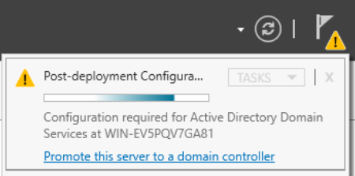

Select this and the AD DS configuration wizard will open. Select `Add a new forest` as the deployment operation, with the root domain name `lab.ca`. Change the NetBIOS name to `LAB`. Press `Install` at the end of the wizard. The installation process will take at least a few minutes. When it's finished, open up a web browser on DC1 and navigate to `https://172.16.0.1` to reach the OPNsense web GUI. 
### OPNsense DHCP Configuration

You can go through the configuration wizard, setting the OPNsense VM's hostname and domain name. Set the DNS server to `172.16.0.11`. 

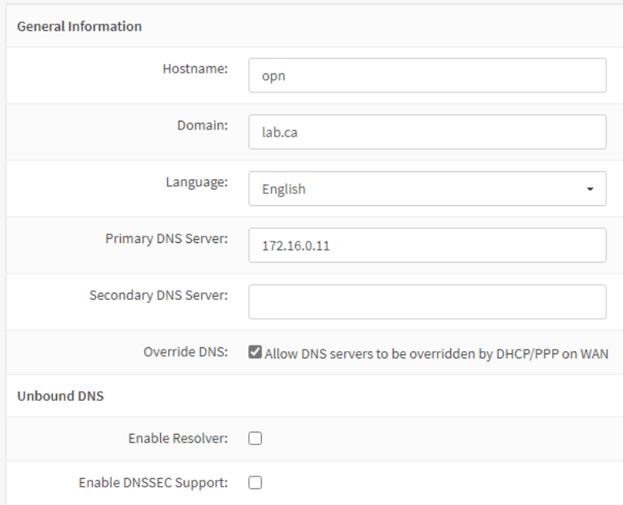

On the WAN interface options page, **uncheck** the `Block RFC1918 Private Networks` option. 

When you are finished with the wizard, go to `Services -> ISC DHCPv4 -> [LAN]`. Set the DNS server, gateway, and domain name as follows.

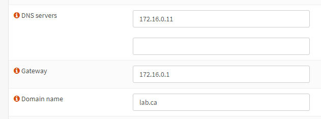

Before we move on, let's change the machine name to DC1. In Server Manager, click `Local Server` on the left side. Click on the computer name, which will open System Properties. Press `Change`. You will see a warning because we are doing this after setting up AD DS, but it's fine because none of our other hosts are using AD yet. Set the computer name to DC1 and reboot the VM.

### Promoting DC2

Now, log in to DC2. Open Command Prompt and run `C:\Windows\System32\Sysprep\sysprep.exe`. The Sysprep GUI will open; check the `Generalize` option.

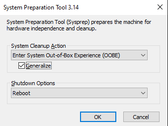

This step is vital because you will not be able to promote this server to a DC without running Sysprep. Because we cloned the DC1 VM, some of the system information is the exact same. Namely, the [SID](https://learn.microsoft.com/en-us/windows-server/identity/ad-ds/manage/understand-security-identifiers) will be the same, which will prevent this server from joining the domain. Running Sysprep will remove any computer-specific information, like the SID. 

After that, follow the same process we did on DC1 to change the machine name. Name the machine `DC2` and also select the `Domain` option to join it to the domain.

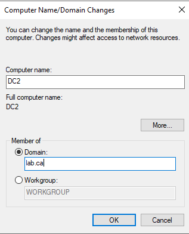

After pressing `OK`, you will be prompted to enter credentials; use `LAB\Administrator` and whatever password you set, then reboot the VM. When at the login screen, press `Other user` and log in as the `LAB\Administrator` user.

Next, still on DC2, set a static IP like we did on DC1; I'll be using `172.16.0.12`. However, instead of setting the DNS server to our OPNsense IP, set it to the DC1 IP, `172.16.0.11`.

Then, in Server Manager, press `Add roles and features` again. This time we'll only add `Active Directory Domain Services`. Once it installs, promote the server to a DC. This time, use the `Add a domain controller to an existing domain` deployment operation. Set the domain to `lab.ca`. If you logged in as the local `Administrator` user instead of `LAB\Administrator`, you'll need to enter credentials: use the username `LAB\Administrator` and whatever password you set.

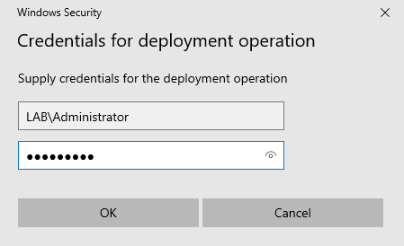

### Joining PCs to the Domain

Now we just need to join our PCs to the domain. However, first we need to create the users for each PC on one of the DCs - it doesn't matter which. I will be creating the users `Hayden Nolan` and `Nolan Hayden` for use on each PC.

In Server Manager, open the `Tools` dropdown menu from the navbar towards the right side. Choose `Active Directory Users and Computers`. Expand the dropdown menu for `lab.ca` on the left side, right click `Users`, and select `New -> User`.

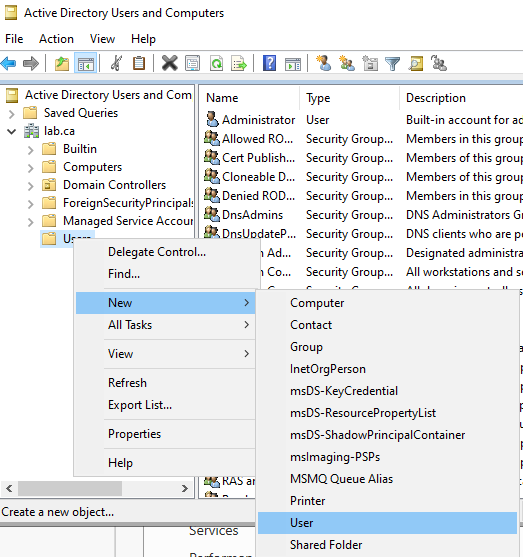

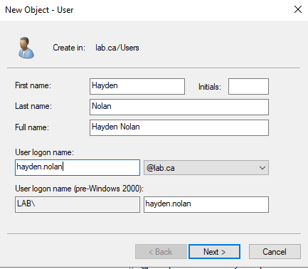

Repeat for the second user.

Next, log into either Win11 VM (process will be identical on both), press the Windows key, and search for `Access work or school`. Click the `Connect` button to add a new account. Click the Active Directory option, and enter `lab.ca` as the domain to join. When prompted, enter the same `LAB\Administrator` credentials we have used previously.

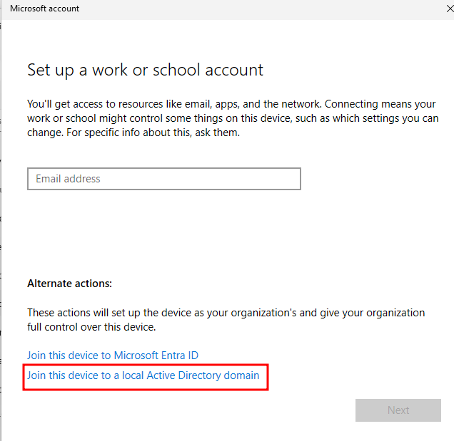

Note: if you get an error about not being able to find the domain, open command prompt and enter `ipconfig /release` followed by `ipconfig /renew` - this will release our old DHCP lease and request a new one. This may be necessary depending on the order of operations you took - if your VM got a DHCP lease before we set the domain and DNS settings in OPNsense, it won't be able to contact the DC.

You will be prompted to add a new user account for this PC. Use one of the two users we created on the DC previously, then restart the VM. Repeat the process on the other PC, using the other user account.

## Elastic

Log into our Ubuntu Server VM and run the following to easily deploy an ELK stack:
```bash
sudo apt update && sudo apt upgrade -y
curl -fsSL https://get.docker.com -o get-docker.sh
sudo sh ./get-docker.sh

git clone https://github.com/deviantony/docker-elk && cd docker-elk
sudo docker compose up setup
pw=$(openssl rand -hex 32)
echo "xpack.security.encryptionKey: \"${pw}\"" >> kibana/config/kibana.yml
echo "xpack.encryptedSavedObjects.encryptionKey: \"${pw}\"" >> kibana/config/kibana.yml
echo "server.publicBaseUrl: \"http://siem.lab.ca:5601\"" >> kibana/config/kibana.yml
sudo docker compose up -d
```

Now log onto DC1. We'll create a DNS record so we can access the Kibana web UI via the URL in the config commands above. 

Open the `Tools` dropdown menu from the Server Manager navbar and select `DNS`. In the DNS Manager window, expand the dropdowns on the left side: `DC1 -> Forward Lookup Zones`. Right click `lab.ca` and select `New Host (A or AAAA)...`.

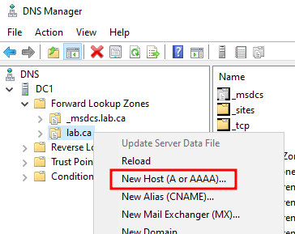

Enter the name `siem` and the IP `172.16.0.2`, which we configured during the VM installation, and click `Add Host`. Now, if you visit `http://siem.lab.ca:5601` in the browser of any of our Windows machines, you will see the Kibana login screen. The default login credentials are `elastic:changeme`.

Note: you might see this error. This is caused by an out of date browser - you can either update Edge or download the latest version of any other browser.

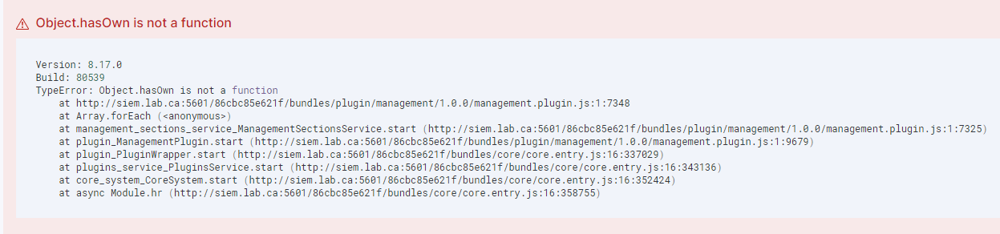

Once you're logged into Kibana, 

- install Elastic agents and look at other integrations
